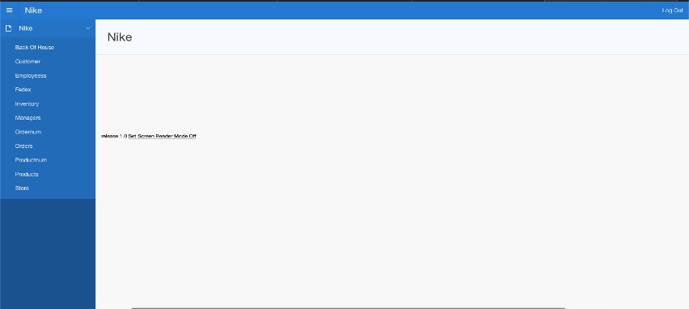
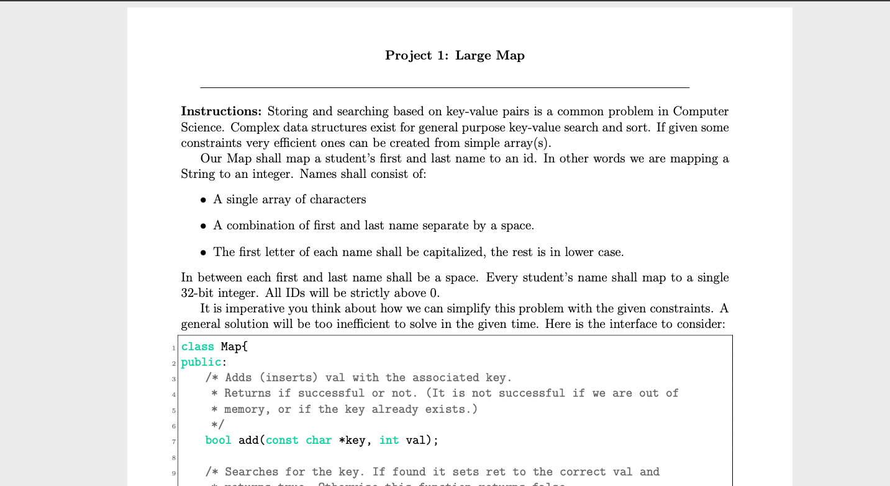

Portfolio
=========

Programming Projects
--------------------

*For access to my private project repositories, please [email me](mailto:kttyler@csustudent.net?subject=GitHub%20Access) with the subject line, GitHub Access.

---
### [Inventory Project | CSCI 419](project1)

---
### [Final Website | CSCI 332](project2)

---
### [Battleship | CSCI 325](project3)

---
### [Large Map | CSCI 315](project4)

---

Ethics Papers
-------------

### [Intellectual Property](https://csustudentnet-my.sharepoint.com/:w:/r/personal/kttyler_csustudent_net/Documents/ethics%20paper%20applied%20networkin.docx?d=we13ace9f5c414fadaf3dcadc5f4c9279&csf=1&web=1&e=9EaHE5)

-   **Class: CSCI 332**  
-   **Grade: A**

### [THERAC-25](https://csustudentnet-my.sharepoint.com/:w:/r/personal/kttyler_csustudent_net/Documents/ethics2020%20csci315.docx?d=wc4c06903e9eb4d059bf18d7336155fe5&csf=1&web=1&e=aSjfRwpdf)

-   **Class: CSCI 315** 
-   **Grade: A**

### [The Good Hacker](https://csustudentnet-my.sharepoint.com/:w:/r/personal/kttyler_csustudent_net/Documents/Assignment%206%20Ethics%20Paper%20Tyler.docx?d=w70232dcbfe52416890882ebf8aaf9994&csf=1&web=1&e=tJw5pipdf)

-   **Class: CSCI 210** 
-   **Grade: A**

---

Presentations
-------------

### [Target Credit Card Breach](https://csustudentnet-my.sharepoint.com/:p:/r/personal/kttyler_csustudent_net/Documents/project.pptx?d=w78c6bb54e77d4daf893c1ff0ae846a3d&csf=1&web=1&e=KorYof)

- **Class:CSCI 301** 
- **Grade: A**

### [Why Christians Should Study Computer Science](https://csustudentnet-my.sharepoint.com/:p:/r/personal/kttyler_csustudent_net/Documents/intro%20to%20comp%20sci.pptx?d=wbdb91b75e5a64f8288167b49942ac77b&csf=1&web=1&e=qD1i21)

- **Class: CSCI 210** 
- **Grade: A**

---

Page template forked from <a href="https://github.com/csu-cs/csci-portfolio">CSU-CS</a>

<!-- Remove above link if you don't want to attributive -->
