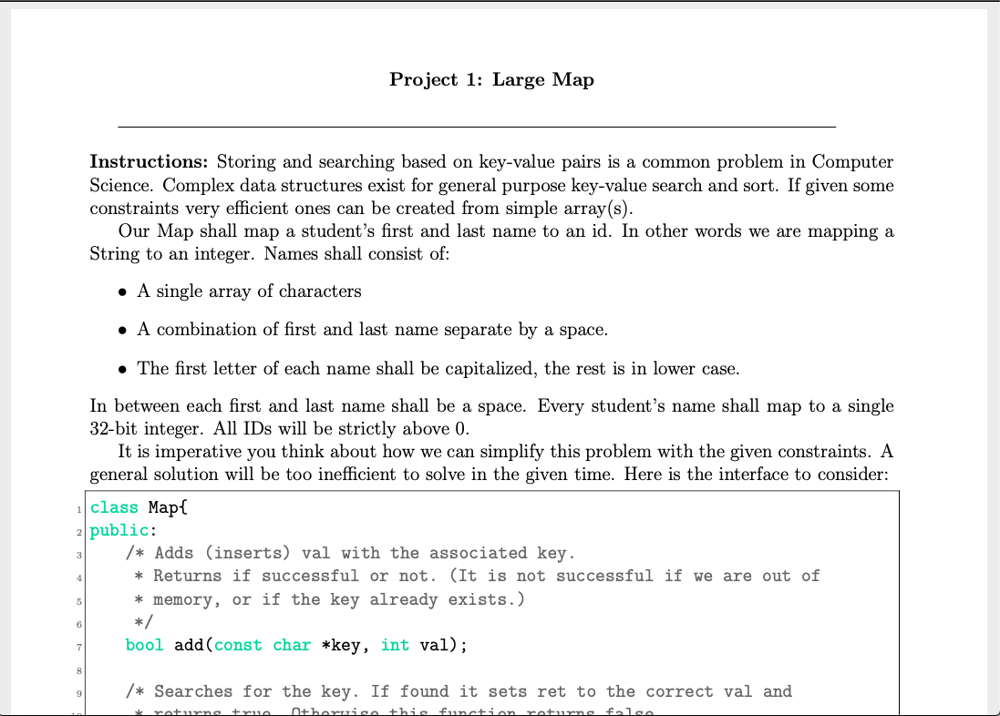

Portfolio
=========

Programming Projects
--------------------

*For access to my private project repositories, please [email me](mailto:kttyler@csustudent.net?subject=GitHub%20Access) with the subject line, GitHub Access.

---
### [Inventory Project | CSCI 419](project1)

---
### [Final Website | CSCI 332](project2)

---
### [Battleship | CSCI 325](project3)

---
### [Large Map | CSCI 315](project4)

---

Ethics Papers
-------------

### [Intellectual Property](https://csustudentnet-my.sharepoint.com/:w:/g/personal/kttyler_csustudent_net/EZ_OOuFBXK1Prz3K3F9MknkB4itx-BF-Aqj_GAc6WeDOjw?e=7Fu9MP)

-   **Class: CSCI 332**  
-   **Grade: A**

### [THERAC-25](https://csustudentnet-my.sharepoint.com/:w:/g/personal/kttyler_csustudent_net/EQNpwMTr6QVNm_GNczYVX-UBsaJUkRdrPxnkiLRf12Vx_Q?e=i5SLwg)

-   **Class: CSCI 315** 
-   **Grade: A**

### [The Good Hacker](https://csustudentnet-my.sharepoint.com/:w:/g/personal/kttyler_csustudent_net/EcstI3BS_mhBkIguv4qvmZQBXUB7_AivcO3dfT5Ut5m_FA?e=RaT1ND)

-   **Class: CSCI 210** 
-   **Grade: A**

---

Presentations
-------------

### [Target Credit Card Breach](https://csustudentnet-my.sharepoint.com/:p:/g/personal/kttyler_csustudent_net/EVS7xnh9569NiTwf8K6Eaj0BTZ2VPfJSi2ZpSt24JAwUEA?e=ZriZcB)

- **Class:CSCI 301** 
- **Grade: A**

### [Why Christians Should Study Computer Science](https://csustudentnet-my.sharepoint.com/:p:/g/personal/kttyler_csustudent_net/EXUbub2m5YJPiBZ7SZQqx3sBaJbYXQNLK7SHkSdiCZBFIw?e=8YBopt)

- **Class: CSCI 210** 
- **Grade: A**

---

Page template forked from <a href="https://github.com/csu-cs/csci-portfolio">CSU-CS</a>

<!-- Remove above link if you don't want to attributive -->
