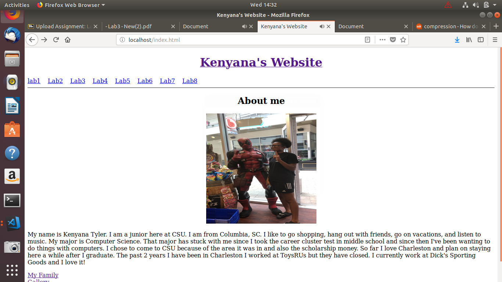
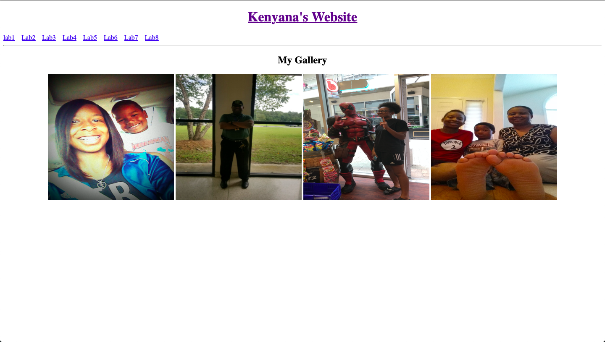
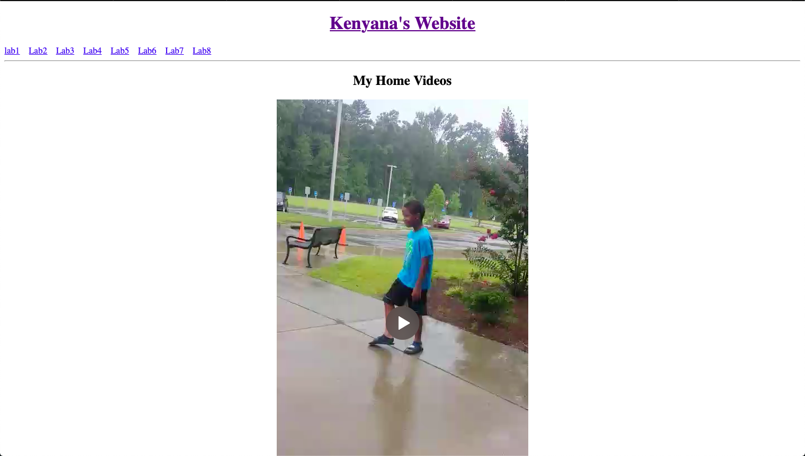

[Back to Portfolio](./)

Final Website
===============

-   **Class: CSCI 332** 
-   **Grade: A**
-   **Language(s): Html**
-   **Source Code Repository:** [features/mastering-markdown](https://guides.github.com/features/mastering-markdown/)  
    (Please [email me](mailto:kttyler@csustudent.net?subject=GitHub%20Access) to request access.)

## Project description
For this project I had to created a website displaying the 5 different labs for the class, an about me page, a page of pictures, videos, and about my family. We used Ubuntu to make this and run the program. 

## How to compiles / run the program
To run the program we used mozilla firefox and typed in our own personal link that we had to pull up the website. 

## UI Design

Fig 1. The home screen.

Fig 2. Different page.

Fig 3. Different page.

## 3. Additional Considerations

This project is a representation of everything I've learned throughout the class from adding music, to making different pages by coding it, as well as adding pictures and paragraphs.   

For more details see [GitHub Flavored Markdown](https://guides.github.com/features/mastering-markdown/).

[Back to Portfolio](./)

