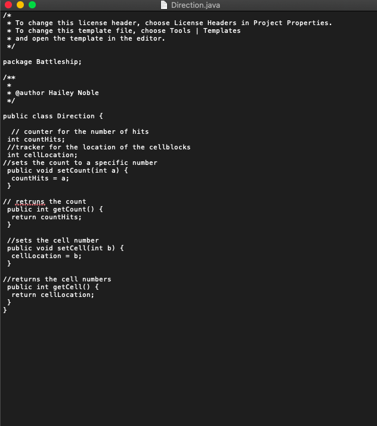

[Back to Portfolio](./)

Inventory Project
===============

-   **Class: CSCI 325** 
-   **Grade: B**
-   **Language(s): Java, JavaScript**
-   **Source Code Repository:** [features/mastering-markdown](https://guides.github.com/features/mastering-markdown/)  
    (Please [email me](mailto:kttyler@csustudent.net?subject=GitHub%20Access) to request access.)

## Project description
For this project my group and I created a game called battleship. It's the typical battleship game where there is a hit and miss, when your hit all the persons ships the game is over and terminates. When there is a hit you'll hear a sound effect and see a blown up picture pop up or a target shown. When you miss the word miss will pop up and you will hear a sound effect as well. 

## How to compiles / run the program

The program is ran through netbeans. All you have to do is hit run program and you are playing against the computer so may the best man win! 

## UI Design
 The user interface for this will consists of the user using buttons to determine where they want to move their ships, where they want to hit the opponents at with the given spaces, so on and so forth. 

Fig 1. How the ships look.

Fig 2. UML use case.

Fig 3. Code for how to change direction of the ships.

## 3. Additional Considerations

This project was very time consuming and doing it with a team was great. I still play it from time to time and would recommend you do so as well. It's a digital version of battleship that I think everyone will enjoy.

For more details see [GitHub Flavored Markdown](https://guides.github.com/features/mastering-markdown/).

[Back to Portfolio](./)
