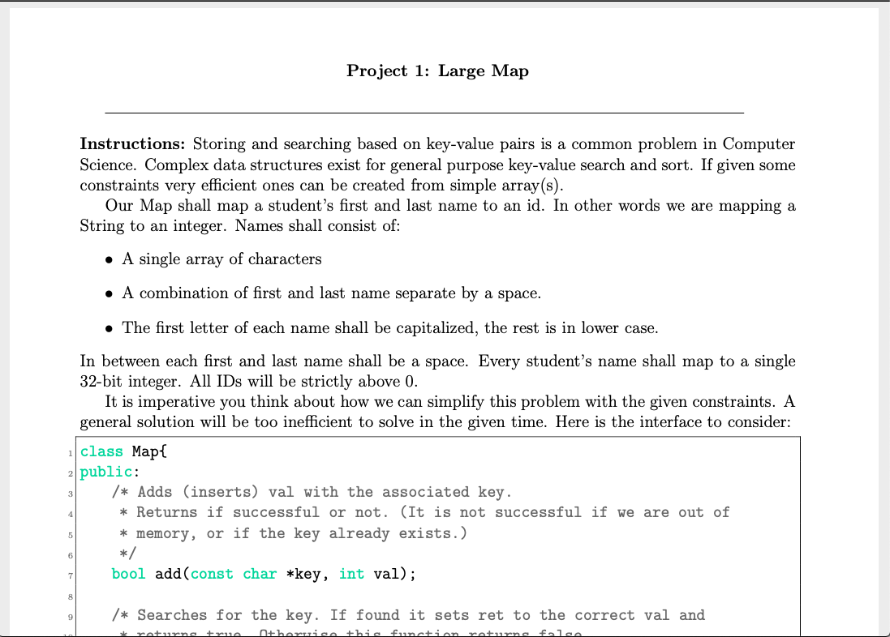

[Back to Portfolio](./)

Large Map 
===============

-   **Class: CSCI 315** 
-   **Grade: C**
-   **Language(s): C++**
-   **Source Code Repository:** [features/mastering-markdown](https://guides.github.com/features/mastering-markdown/)  
    (Please [email me](mailto:kttyler@csustudent.net?subject=GitHub%20Access) to request access.)

## Project description
For this project I had to map a student's first and last name to an id which means in other words map a string to an integer. Each student's name will map to a single 32-bit integer. I will also have to display the performance search as well as the performance of how many. 

## How to compiles / run the program

The program is ran through the terminal on ubuntu. 

## UI Design

Fig 1. How many timing. 

Fig 2. Search timing.

Fig 3. Project.

## 3. Additional Considerations

This project is something I wasn't too confident with due to not being so strong suited when it came to mapping things. Overall this was a pretty good and in depth project. 

For more details see [GitHub Flavored Markdown](https://guides.github.com/features/mastering-markdown/).

[Back to Portfolio](./)
